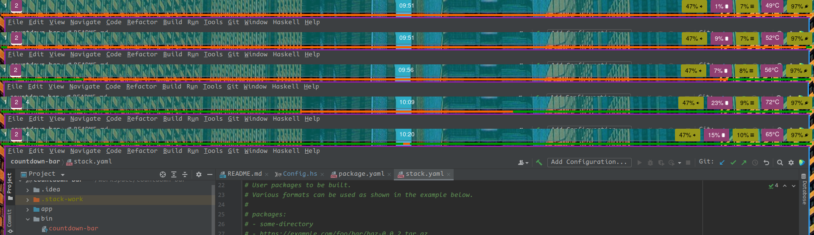

# countdown-bar
Spawns a rectangular window where a colored bar ticks down towards the middle of the screen over 25 minutes.

A possible use case would be to implement a visual [Pomodoro](https://en.wikipedia.org/wiki/Pomodoro_Technique)-Timer.

One solution using the wayland compositor [Sway](https://github.com/swaywm/sway):

Clone this repository, then configure a sway hotkey to start the timer:
´git clone git@github.com:AndreiUlmeyda/countdown-bar.git´
...and inside of your sway config
´bindsym $mod+t exec '<your-directory>/countdown-bar/bin/countdown-bar'´

At this point the window will be spawned in some random place depending on your sway configuration.
You will likely need to position it to your liking by specifying a rule inside of your sway config like
´for_window [title="^tomato$"] floating enable, resize set 1900 5, move position -10 -10, border none, sticky enable`

Spice things up a bit by ripping silly beep boop noises from the game Alien: Isolation or your favourite
website collecting Star Trek samples and play them at the start and/or end of the timer.

After installing something like [sox](http://sox.sourceforge.net/):
´bindsym $mod+t exec ';play <beep-boop.mp3>; <your-directory>/countdown-bar/bin/countdown-bar'; play <brrt-bip-bip-boop.mp3>´

Then proceed to be a significantly happier person than you were before.

!Warning! The window dimensions are, as of now, arbitrarily set to fit my use case. If you need different dimensions,
then you might need to set different values inside the file src/Config.hs and then recompile the binary. An issue
exists to supply proper configuration mechanisms together with plans to implement this in the near future.
